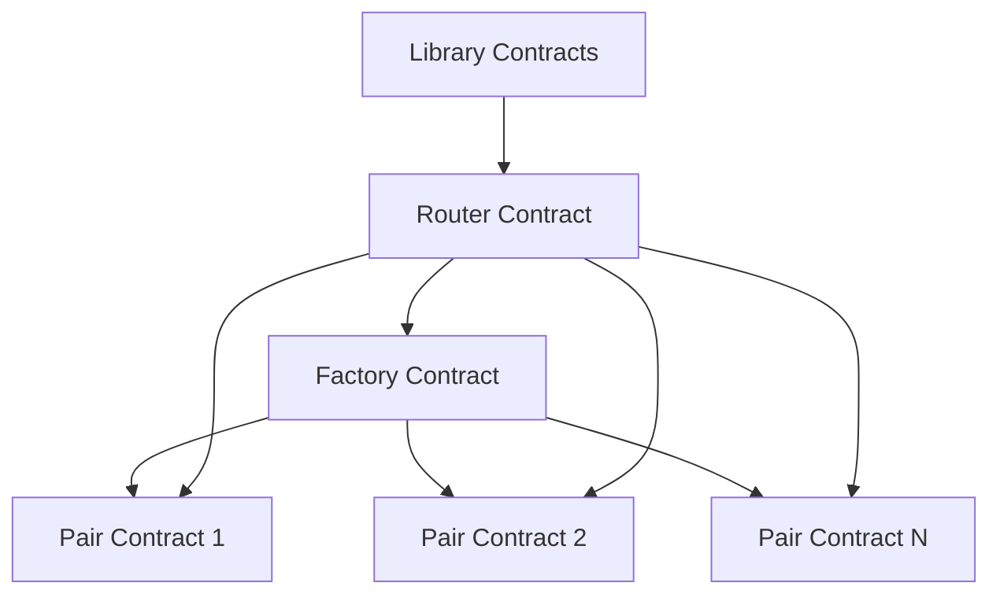

# UniswapV2 Core 智能合约架构分析 - 4view

## 逻辑视图 (Logical View)
### 核心概念模型
- **Factory Pattern**: 工厂合约管理交易对创建
- **AMM Model**: 恒定乘积自动化做市商 (x * y = k)
- **LP Token**: 流动性提供者代币机制
- **Router Pattern**: 高级接口封装底层操作

### 关键抽象
- ```solidity
  // 核心不变量
  x * y = k (恒定乘积)
  
  // 手续费模型  
  fee = 0.3% per swap
  
  // 流动性计算
  liquidity = sqrt(amount0 * amount1) // 首次
  liquidity = min(a0*supply/r0, a1*supply/r1) // 后续
  ```

### 领域模型
- **Token Pair**: 两个ERC20代币的交易对
- **Liquidity Pool**: 流动性资金池
- **Price Oracle**: TWAP时间加权平均价格
- **Swap Path**: 多跳交换路径

## 开发视图 (Development View)
### 合约架构
```
├── UniswapV2Factory.sol         # 工厂合约
├── UniswapV2Pair.sol           # 交易对核心逻辑
├── UniswapV2Router02.sol       # 用户接口路由
├── UniswapV2ERC20.sol         # LP代币实现
├── interfaces/                # 接口定义
│   ├── IUniswapV2Factory.sol
│   ├── IUniswapV2Pair.sol
│   └── IUniswapV2Router02.sol
└── libraries/                 # 工具库
    ├── Math.sol              # 数学运算
    ├── UQ112x112.sol        # 固定点数学
    └── UniswapV2Library.sol # 核心计算逻辑
```

### 关键设计模式
- **Factory Pattern**: UniswapV2Factory创建标准化Pair
- **Proxy Pattern**: Router作为Pair的代理
- **Library Pattern**: 复用数学计算逻辑
- **Reentrancy Guard**: 防重入锁机制

### 核心数据结构
- ```solidity
  // 储备量优化存储 (单slot)
  uint112 private reserve0;
  uint112 private reserve1; 
  uint32 private blockTimestampLast;
  
  // 交易对映射
  mapping(address => mapping(address => address)) public getPair;
  
  // 价格累积器
  uint public price0CumulativeLast;
  uint public price1CumulativeLast;
  ```

## 进程视图 (Process View)
### 创建交易对流程
- **Step 1**: `Factory.createPair(tokenA, tokenB)`
  - 验证: `tokenA != tokenB && token0 != address(0)`
  - 排序: `(token0, token1) = tokenA < tokenB ? (tokenA, tokenB) : (tokenB, tokenA)`
  - 部署: `CREATE2(salt=keccak256(token0,token1))`
  - 初始化: `pair.initialize(token0, token1)`

### 添加流动性流程  
- **Step 1**: 计算最优数量 `Router._addLiquidity()`
- **Step 2**: 转账代币到Pair `TransferHelper.safeTransferFrom()`
- **Step 3**: 铸造LP代币 `Pair.mint(to)`
  - 首次: `liquidity = sqrt(amount0 * amount1) - MINIMUM_LIQUIDITY`
  - 后续: `liquidity = min(amount0*supply/reserve0, amount1*supply/reserve1)`

### 交换流程
- **Step 1**: 计算输出量 `UniswapV2Library.getAmountOut()`
- **Step 2**: 转账输入代币到Pair
- **Step 3**: 执行交换 `Pair.swap(amount0Out, amount1Out, to, data)`
  - 乐观转账输出代币
  - 验证K值不变量: `balance0Adjusted * balance1Adjusted >= reserve0 * reserve1 * 1000^2`

### 移除流动性流程
- **Step 1**: 转账LP代币到Pair
- **Step 2**: 销毁LP代币 `Pair.burn(to)`  
- **Step 3**: 按比例返还底层资产

## 物理视图 (Physical View)  
### 部署架构


### 存储优化
- **Packed Storage**: reserve0(112) + reserve1(112) + timestamp(32) = 256bits
- **CREATE2 Deterministic**: 可预测的Pair地址
- **Gas Optimization**: 批量操作减少外部调用

### 安全模型
#### ✅ 已实现防护
- **Reentrancy Guard**: 
  ```solidity
  uint private unlocked = 1;
  modifier lock() {
      require(unlocked == 1, 'UniswapV2: LOCKED');
      unlocked = 0; _; unlocked = 1;
  }
  ```
- **Overflow Protection**: Solidity ^0.8.0 内置检查
- **Access Control**: `onlyFactory` / `onlyFeeToSetter`
- **Slippage Protection**: `amountMin` 参数

#### ⚠️ 安全风险点
- **Price Manipulation**: 单区块大额交易影响价格
- **MEV Attacks**: 三明治攻击、抢跑攻击  
- **ERC20 Compatibility**: 非标准代币兼容性问题
- **Flash Loan Attacks**: 缺少闪电贷专门防护

#### 🔧 优化建议
- **MEV Protection**: 
  - 增加交易延迟机制
  - 实现commit-reveal模式
  - 批量交易处理
- **Enhanced Security**:
  - 紧急暂停功能
  - 最大滑点限制  
  - 多签治理机制
- **Capital Efficiency**:
  - 集中流动性(类V3)
  - 动态手续费调整
  - 多资产池支持

## 架构评估
### 📊 优点评分
- **安全性**: ⭐⭐⭐⭐⭐ (5/5)
- **可扩展性**: ⭐⭐⭐ (3/5) 
- **资本效率**: ⭐⭐ (2/5)
- **Gas效率**: ⭐⭐⭐⭐ (4/5)
- **用户体验**: ⭐⭐⭐⭐ (4/5)

### 🎯 核心优势
- 经过实战验证的AMM模型
- 模块化架构便于维护
- 完善的安全防护机制
- 良好的Gas优化

### 🚧 改进空间  
- 资本效率有待提升
- MEV保护需要加强
- 手续费机制可更灵活
- 多资产支持受限

---
*分析完成时间: {{date}}*
*合约版本: Solidity ^0.8.0*
*参考标准: Uniswap V2 Protocol*