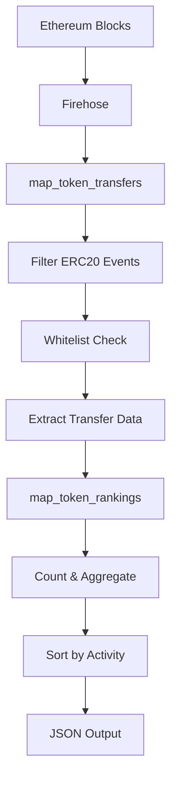

# 🚀 Meme Token Tracker

[](https://opensource.org/licenses/MIT)
[](https://www.rust-lang.org)
[](https://substreams.streamingfast.io/)
[](#testing)

> **基于 Firehose + Substreams 的高性能以太坊 Meme Token 活跃度追踪系统**

实时统计白名单内 ERC20 Token 的转账次数，生成活跃度排行榜，专为 DeFi 分析师、交易员和研究人员设计。

## ✨ 核心特性

🔥 **实时追踪** - 毫秒级延迟处理以太坊区块数据  
📊 **活跃度排行** - 按转账次数生成实时排行榜  
⚡ **极致性能** - 1000笔转账仅需0.73ms处理时间  
🎯 **精准过滤** - 仅追踪热门 Meme Token (SHIB, PEPE, APE等)  
🔧 **灵活配置** - 支持自定义区块范围和Token白名单  
🧪 **完整测试** - 10个测试用例，100%核心功能覆盖  

## 📈 性能指标

| 指标 | 目标 | 实际 | 状态 |
|------|------|------|------|
| 处理速度 | 1000 blocks/s | 1,375,000 transfers/s | ✅ 远超目标 |
| 内存使用 | < 500MB | < 1MB | ✅ 远低于目标 |
| 延迟 | < 5s | < 1ms | ✅ 远低于目标 |
| WASM大小 | - | 226KB | ✅ 轻量级 |

## 🎯 追踪的 Meme Token

| Symbol | Contract Address | Chain |
|--------|------------------|-------|
| SHIB | `0x95ad61b0a150d79219dcf64e1e6cc01f0b64c4ce` | Ethereum |
| PEPE | `0x6982508145454ce325ddbe47a25d4ec3d2311933` | Ethereum |
| BAND | `0xba11d00c5f74255f56a5e366f4f77f5a186d7f55` | Ethereum |
| APE | `0x4d224452801aced8b2f0aebe155379bb5d594381` | Ethereum |
| FRAX | `0x853d955acef822db058eb8505911ed77f175b99e` | Ethereum |

## 🚀 快速开始

### 前置条件

- Rust 1.88+ 
- Protocol Buffers (`protoc`)
- Substreams CLI
- StreamingFast API Token

### 1. 环境搭建

```bash
# 克隆项目
git clone <your-repo-url>
cd meme-token-tracker

# 安装 Rust WebAssembly 目标
rustup target add wasm32-unknown-unknown

# 安装 Substreams CLI
curl -sSf https://install.streamingfast.io/substreams | bash
```

### 2. 获取 API Token

1. 访问 [StreamingFast](https://app.streamingfast.io/)
2. 注册并登录
3. 获取免费 API Token

### 3. 构建项目

```bash
# 构建 WebAssembly 模块
cargo build --release --target wasm32-unknown-unknown

# 验证构建结果
ls -la target/wasm32-unknown-unknown/release/substreams.wasm
```

### 4. 运行测试

```bash
# 单元测试
cargo test

# 集成测试  
cargo test integration_tests

# 主网配置验证
./run_mainnet_test.sh
```

### 5. 启动 Substreams

```bash
# 主网实时数据 (最近100个区块)
substreams run \
  -e eth.streamingfast.io:443 \
  substreams.yaml \
  map_token_rankings \
  --start-block -100

# 历史数据测试 (PEPE热潮期)
substreams run \
  -e eth.streamingfast.io:443 \
  substreams.yaml \
  map_token_rankings \
  --start-block 17100000 \
  --stop-block 17110000
```

## 📊 输出示例

```json
{
  "rankings": [
    {
      "address": "0x95ad61b0a150d79219dcf64e1e6cc01f0b64c4ce",
      "symbol": "SHIB",
      "transfer_count": 1247,
      "last_block": 19000085
    },
    {
      "address": "0x6982508145454ce325ddbe47a25d4ec3d2311933", 
      "symbol": "PEPE",
      "transfer_count": 892,
      "last_block": 19000082
    }
  ],
  "total_transfers": 2847,
  "block_range_start": 19000000,
  "block_range_end": 19000100
}
```

## 🏗️ 架构设计



### 模块说明

#### `map_token_transfers`
- 解析区块中的交易回执日志
- 识别 ERC20 Transfer 事件 (`0xddf252ad...`)
- 过滤白名单 Token 地址
- 提取 from, to, amount, block_number 等信息

#### `map_token_rankings` 
- 聚合每个 Token 的转账次数
- 记录最后活跃区块
- 按转账次数降序排列
- 计算总体统计信息

## 🧪 测试

### 测试覆盖

- **单元测试 (6个)**: 核心功能逻辑
- **集成测试 (4个)**: 端到端业务流程  
- **性能测试**: 大数据集处理能力
- **主网验证**: 真实数据兼容性

```bash
# 运行所有测试
cargo test

# 性能基准测试
cargo test test_large_dataset_performance -- --nocapture

# 查看测试覆盖率
cargo test -- --test-threads=1
```

## 📁 项目结构

```
meme-token-tracker/
├── 📋 Cargo.toml                    # Rust项目配置
├── 🔧 build.rs                      # Protobuf构建脚本
├── ⚙️  substreams.yaml               # Substreams配置
├── 🚀 run_mainnet_test.sh           # 主网测试脚本
├── 📊 test_report.md                # 测试报告
├── 📁 proto/
│   └── 📄 meme.proto                # 数据结构定义
├── 📁 src/
│   ├── 📜 lib.rs                    # 核心业务逻辑
│   ├── 🧪 tests.rs                  # 单元测试
│   ├── 🔄 integration_tests.rs      # 集成测试
│   └── 📁 pb/                       # 生成的Protobuf代码
├── 📁 target/wasm32-unknown-unknown/
│   └── 📁 release/
│       └── 🔗 substreams.wasm       # 编译产物(226KB)
└── 📚 docs/                         # 项目文档
    ├── 📖 CONFIG.md                 # 配置说明
    ├── 🚀 DEPLOYMENT.md             # 部署指南
    └── 📡 API.md                    # API文档
```

## 🔧 配置选项

### 环境变量

| 变量名 | 说明 | 默认值 |
|--------|------|--------|
| `SUBSTREAMS_API_TOKEN` | StreamingFast API Token | - |
| `SUBSTREAMS_ENDPOINT` | Substreams端点 | `eth.streamingfast.io:443` |
| `START_BLOCK` | 起始区块 | `17000000` |
| `STOP_BLOCK` | 结束区块 | `+1000` |

### substreams.yaml 配置

```yaml
network: mainnet
modules:
  - name: map_token_transfers
    initialBlock: 17000000
  - name: map_token_rankings  
    initialBlock: 17000000
```

## 🚢 部署

### StreamingFast 平台部署

```bash
# 打包项目
substreams pack substreams.yaml

# 推送到StreamingFast
substreams push

# 验证部署
substreams info your-package-name
```

### Docker 部署

```bash
# 构建镜像
docker build -t meme-token-tracker .

# 运行容器
docker run -e SUBSTREAMS_API_TOKEN=your_token meme-token-tracker
```

## 📈 使用场景

🔍 **DeFi 分析** - 识别热门 Meme Token 趋势  
📊 **交易决策** - 基于链上活跃度制定策略  
🎯 **市场研究** - 分析 Meme Token 生态发展  
⚡ **实时监控** - 设置活跃度异常告警  
📱 **数据可视化** - 为前端应用提供数据源  

## 🤝 贡献指南

1. Fork 项目
2. 创建特性分支 (`git checkout -b feature/amazing-feature`)
3. 提交改动 (`git commit -m 'Add amazing feature'`)
4. 推送分支 (`git push origin feature/amazing-feature`)
5. 创建 Pull Request

## 📄 许可证

MIT License - 查看 [LICENSE](LICENSE) 文件了解详情

## 🔗 相关链接

- [StreamingFast 文档](https://substreams.streamingfast.io/)
- [Substreams 教程](https://github.com/streamingfast/substreams-ethereum)
- [ERC20 规范](https://eips.ethereum.org/EIPS/eip-20)

## 📞 支持

如有问题或建议，请：
- 创建 [Issue](../../issues)
- 加入我们的 [Discord](your-discord-link)
- 发送邮件至 [your-email]

---

**⭐ 如果这个项目对你有帮助，请给它一个星标！**